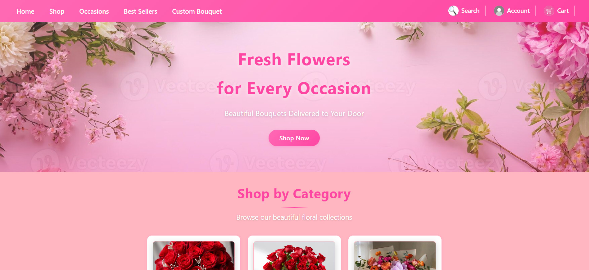
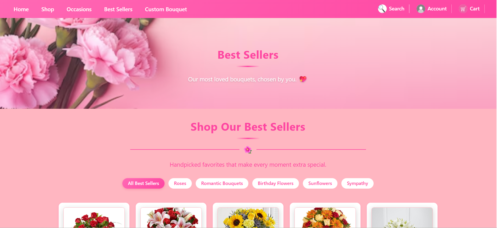
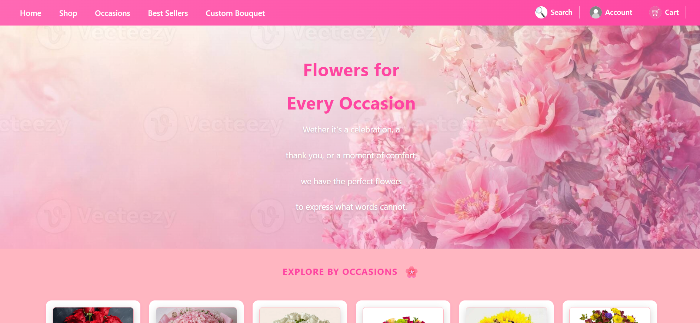
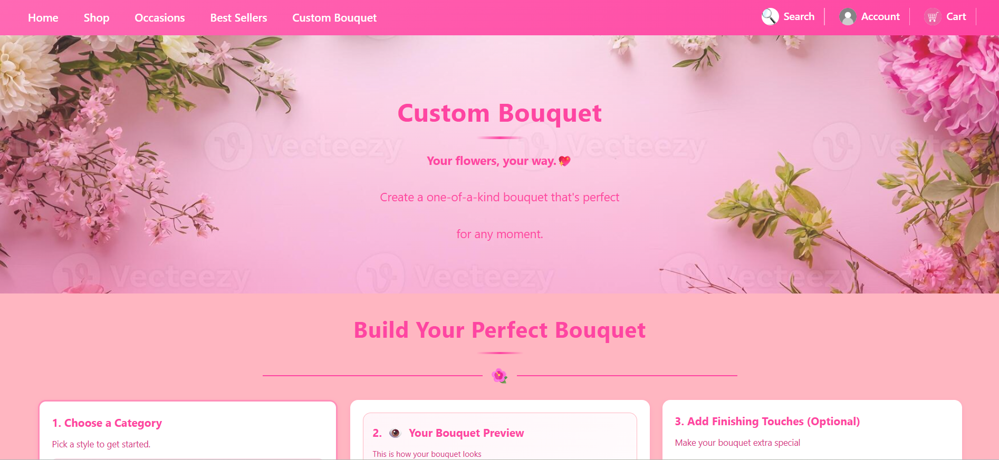
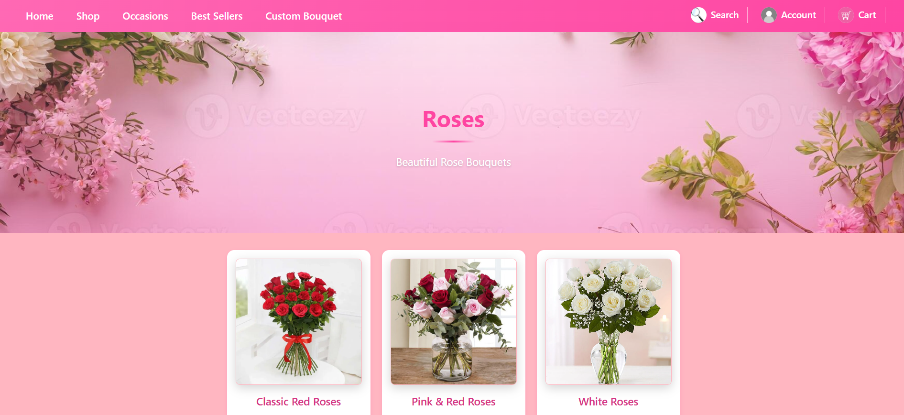
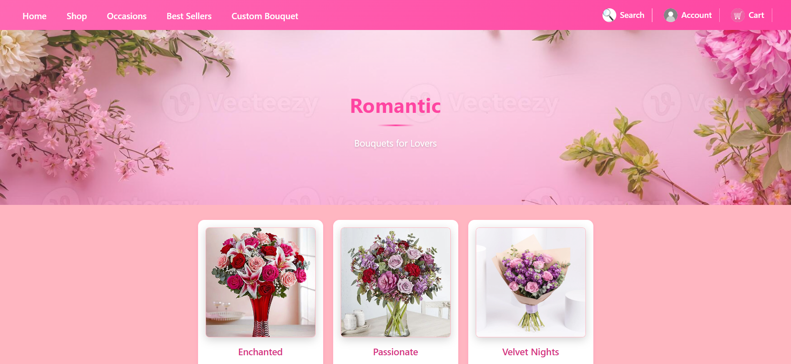
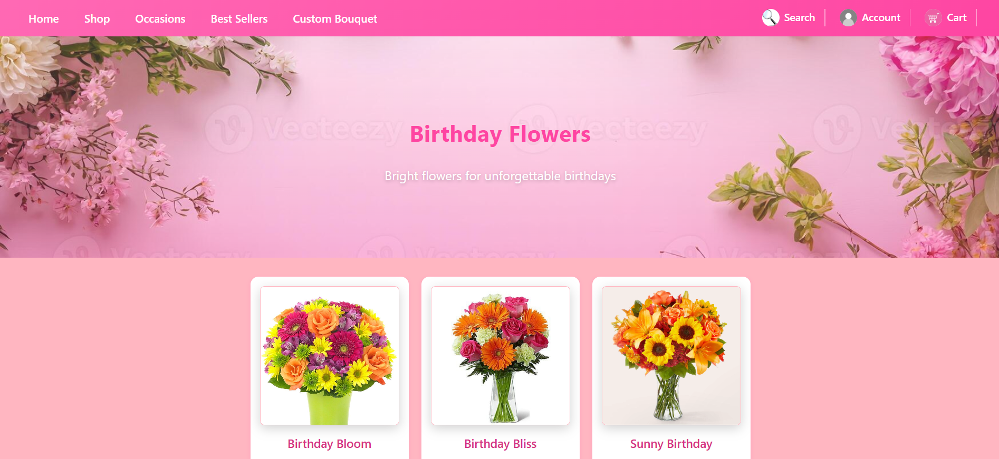

# Blooming Flowers – Online Flower Shop

## Project Description

Blooming Flowers is a ReactJS frontend web application designed to help users browse and explore flower bouquets for different occasions. The website provides a responsive and user-friendly interface where users can view flower categories, browse best sellers, and create custom bouquet selections.

This project was developed for CSCI390 Web Programming – Project Phase 2.

### Features
- Home page
- Browse flower categories
- Best sellers section
- Occasions page
- Custom bouquet page
- Responsive design for desktop and mobile
- Navigation using React Router

---


## Technologies Used

- HTML
- CSS
- JavaScript
- ReactJS
- React Router DOM
- Vite
- GitHub Pages

---

## Setup Instructions

### 1. Clone the repository

```bash
git clone https://github.com/Sara-Yassine/Fleur-Atelier
```

### 2. Open the project folder

```bash
cd react-app
```

### 3. Install dependencies

```bash
npm install
```

### 4. Run the project

```bash
npm run dev
```

### 5. Open in browser

```txt
http://localhost:5173
```

---

## Screenshots of the UI

### Home Page


### Best Sellers Page


### Occasions Page


### Custom Bouquet Page


### Flower Categories Page





---

## Live Demo

GitHub Pages Link:  
https://Sara-Yassine.github.io/Fleur-Atelier/

---

## Author

Student Name: Sara Yassine
Course: CSCI390 Web Programming  
Semester: Spring 2025–2026